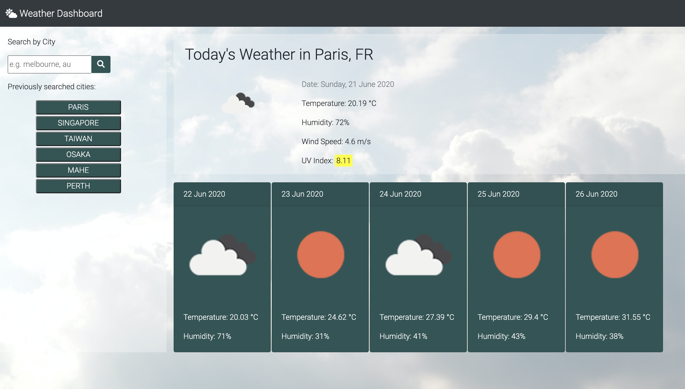

# Weather Dashboard

## User Story

```
AS A traveler
I WANT to see the weather outlook for multiple cities
SO THAT I can plan a trip accordingly
```

## Acceptance Criteria

```
WHEN user searches for a city
user is THEN presented with the current weather as well as five-day forecast for that city and that city is added to the search history
WHEN user views current weather conditions for that city
user is THEN presented with city name, the date, an icon representation of weather conditions, the temperature, the humidity, the wind speed, and the UV index
WHEN user views the UV index
user is THEN presented with a color that indicates whether the conditions are favorable, moderate, or severe
WHEN user views future weather conditions for that city
user is THEN presented with a 5-day forecast that displays the date, an icon representation of weather conditions, the temperature, and the humidity
WHEN user clicks on a city in the search history
user is THEN again presented with current weather and a five-day forecast for the selected city
WHEN user opens the weather dashboard
user is THEN presented with the last searched city forecast
```

## Additions

```
Added a Geolocation at the start to get the user's location
If unable to geolocate, it will result to default which is Melbourne, AU
Previously Searched Cities div only displays up to 10 searches
If user's searches reach more than 10, it will remove the first result from the array and the rendered buttons
```



Link to Deployed Application: https://xtineroq.github.io/cr-hw6-weather-dashboard/
